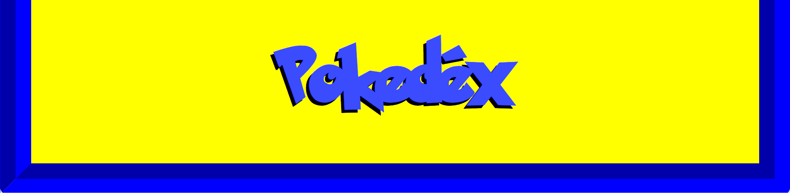

# Pokedéx completa

## O que temos no nosso projeto aqui hein? 🤔
Sejam bem vindos a sua enciclopédia Pokémon! Aonde você poderá ver tudo o que é mais relevante sobre os pokémons e apreender cada vez mais com a gente! Se divirta!!!

### O que está por dentro do projeto?👀
Aqui teremos um site com uma listagem de 10 pokémons iniciais, aonde ao clicarmos em simples botão, teremos uma adição de mais 10 pokémons e cada vez que clicarmos nesse botão, serão sempre adicionados cada vez mais pokémons de 10 em 10.
Não só isso tudo, ainda ao clicarmos na imagem ou nome do pokémon, entraremos nos detalhes do monstrinho, aonde teremos informações como os movimentos (golpes) do carinha, as habilidades do cara e o(s) tipo(s) que esse carinha pertence. Ali também teremos um botão que poderemos voltarmos para a nossa pokedéx inicial, top né?
Ainda como se não bastasse, ainda teremos um botãozinho extra no topo da página, que ao clicarmos nele, poderemos alternar entre um tema escuro, ou voltar para um tema claro novamente.
Pra finalizar, teremos um filtro logo abaixo do botão do tema que nos permitirá filtramos, em tempo real, o tipo de um pokémon para podermos encontrá-lo mais rapidamente, tá ok?
Então cai pra dentro!

### Qual é a finalidade do nosso projeto?👨‍🎓
Aqui, vamos nos divertir para podermos entrar no mundo pokémon de cabeça, aprendendo tudo o que é mais importante sobre esses monstrinhos. Vamos aprender sobre suas evoluções, movimentos (golpes), habilidades e os tipos que eles são.

### Lá vai um mini spoiler do nosso projeto:🍿
[]

### Quais tecnologias usamos aqui?👨‍💻
📌***HTML5***
📌***CCS3***
📌***JAVASCRIPT***
📌**VITE**
📌**VITEST**
📌**REACT**
📌**REACT-ROUTER-DOM**
📌**BABEL**
📌**CONTEXT API**
📌**AXIOS API**
📌**SPA**
📌**STYLED-COMPONENTS**


### Como fazer para clonar o projeto e abrir ele?🕵️‍♂️
1- Primeiramente vamos clonar os monstrinhos:

Abra o seu GitBash ou o terminal do seu VS Code e cole esse código lá:
```bash
git clone <https://github.com/elioenai-goncalves/pokedex>
```
2- Agora para abrirmos o nosso projeto, cole o código abaixo:
```bash
cd pokedex
```

### E como faço pra utilizar o projeto?🐱‍💻
1- A primeira coisa a fazermos é instalarmos as tecnologias e suas dependências, para isso, é só colar o código abaixo no terminal:
```bash
npm install
```

2- Agora vamos abrir o nosso projeto no nosso navegador, é só colar o código abaixo:
```bash
npm run dev
```

3- Caso queira testar o nosso projeto manualmente, é só colar o código abaixo e esperar o resultado mais que positivo 😬:
```bash
npm run test
```

### O que eu aprendi com esse nosso projeto?🧙‍♂️
Com o nosso projeto aqui, pude ver como precisamos ter bastante atenção nos mínimos detalhes do projeto. Buscar informações ao máximo possível e não se contentar com o mínimo, buscando ainda mais conhecimento e humildade de pedir ajuda quando for necessário.
Pude apreender ainda mais com os meus erros e conhecer mais tecnologias e códigos novos.

### Quais foram realmente as dificuldades que obtive ao fazer esse projeto?🤯
Realmente esse projeto, apesar de parecer simples, foi totalmente desafiador para mim. Inicialmente fiquei um pouco frustado em não estar conseguindo concluir o projeto sem ter que rever meus estudos e conhecer novos códigos e tecnologias.
Tive problemas de compatibilidade nos testes unitários, pois inicialmente estava utilizando um teste com "Jest", porém não estava compatível com a minha versão do "Vite", então tive que migrar o teste para o "Vitest", que foi indiciado inclusive pelos meus monitores do meu curso, no nosso forúm de dúvidas internas. Ai sim consegui finalizar a execução de testes com sucesso.
Tive que utilizar o "Babel" também para compilar as páginas, pois não estavam sendo renderizadas corretamente nos navegadores por algum motivo, provavelmente compatibilidade de versões também, mas no final deu tudo certo.

ENTÃO É ISSO PESSOAL! ENTREM, CURTAM, DIVIRTAM-SE COM O SITE E APRENDAM MAIS E MAIS DESSES NOSSOS MONSTRINHOS, POIS AFINAL, "TEMOS QUE PEGAR!"


